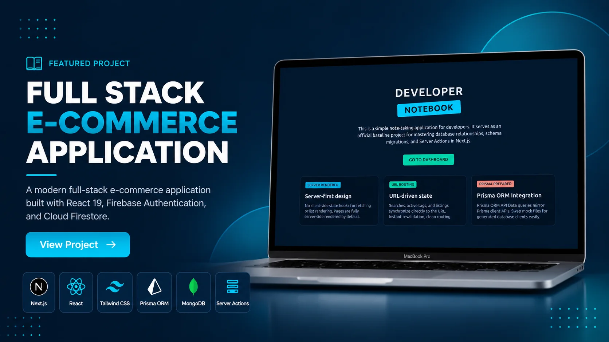

#  DevNotes — Developer Note-Taking App
 
A simple, focused note-taking application built for **developers**. This project serves as an official baseline for mastering **database relationships**, **schema migrations**, and **Server Actions** in **Next.js**.
 


 
---
 
##  Live Demo
 
**Live Preview:** (https://alamin-developer-note.vercel.app/)
 
---
 
##  Features
 
###  Notes
- Create Notes
- Read / View Notes
- Update Notes
- Delete Notes
- Category / Tag wise Notes
- Search Notes
###  Database & Schema
- Prisma Schema Design
- Schema Migrations
- One-to-Many & Many-to-Many Relationships
- MongoDB as Database Provider
###  Core Functionality
- Next.js Server Actions
- REST API Endpoints
- Form Validation
- Loading States
- Error Handling
- SweetAlert2 Confirmation & Alerts
- Toast Notifications
###  Purpose
- Learn Prisma with MongoDB
- Practice Schema Relationships
- Practice Schema Migrations
- Practice Server Actions (mutation without API in some parts)
- Practice REST API structure alongside Server Actions
---
 
##  Tech Stack
 
| Frontend | Backend & Services |
|----------|--------------------|
| Next.js (App Router) | Next.js Server Actions |
| React | Prisma ORM |
| Tailwind CSS (optional) | MongoDB |
| SweetAlert2 | REST API |
| Zod | Schema Validation |
 
---

##  Screenshots


 
---

 

##  Project Structure

```text
├── prisma/
│   ├── schema.prisma
│   └── migrations/
src/
├── actions/
│   ├── note.actions.js
|   └── auth.js
│
├── app/
|   ├── dashboard
│   |    ├── notes/
│   │    |    ├── [id]/
│   │    |    ├── create/
│   │    |    └── page.js
│   │    └── page.js
|   |
|   ├── login
|   |     └── page.js
|   ├── register
|   |     └── page.js
│   └── api/
│
├── components/
│   └── UI/
│
├── libs/
|   ├── handleAlart.js
│   └── prisma.js
└── zod
    ├── loginSchema.js
    └── registerSchema.js
```

---

## ⚡ Getting Started

### Clone the Repository

```bash
git clone https://github.com/your-username/devnotes.git
```

### Navigate to the Project

```bash
cd devnotes
```

### Install Dependencies

```bash
npm install
```

### Setup Prisma

```bash
npx prisma generate
npx prisma db push
```

### Run the Development Server

```bash
npm run dev
```

Open your browser and visit:

```
http://localhost:3000
```

---

##  Environment Variables

Create a `.env` file in the project root.

```env
DATABASE_URL=

NEXTAUTH_SECRET=
NEXTAUTH_URL=http://localhost:3000
```

---


##   Repository

https://github.com/alamin-one/developer-note

---

##   Developed By

**Al-Amin**

GitHub: https://github.com/alamin-one

---

##  License

This project is licensed under the **MIT License**.

---

##  Support

If you found this project helpful, consider giving it a  on GitHub.
